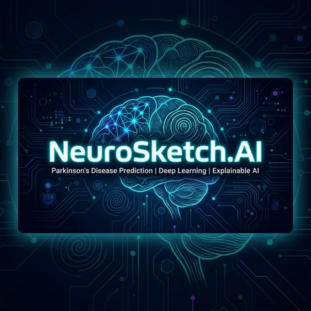
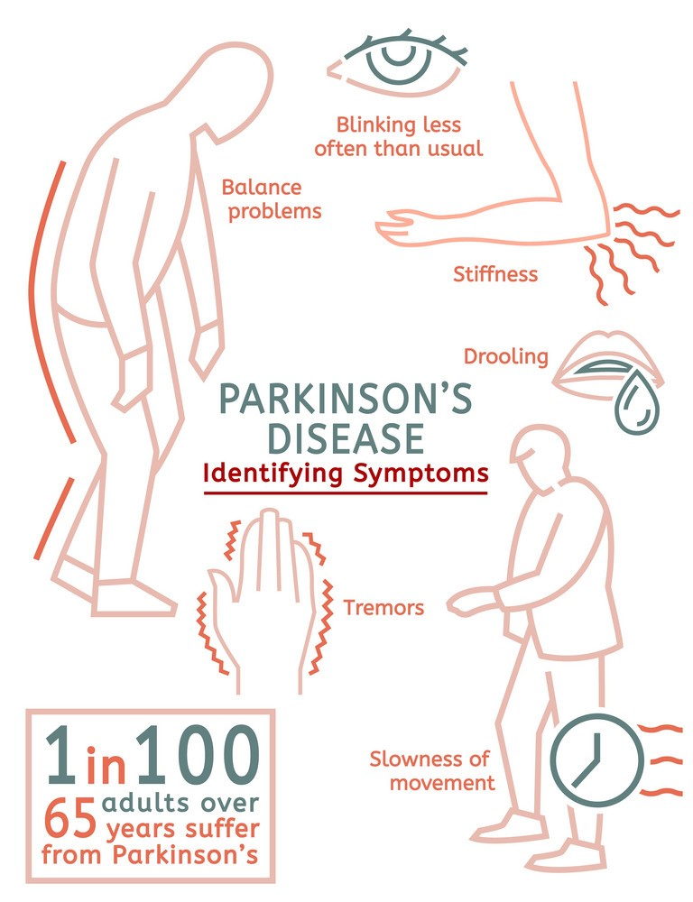
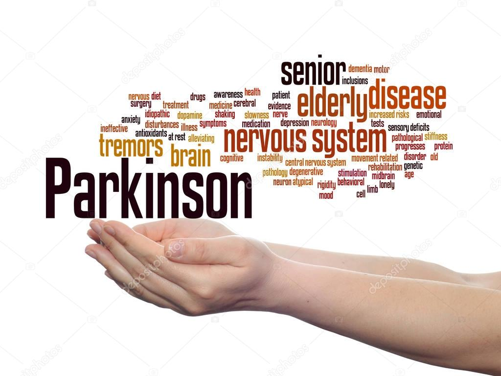
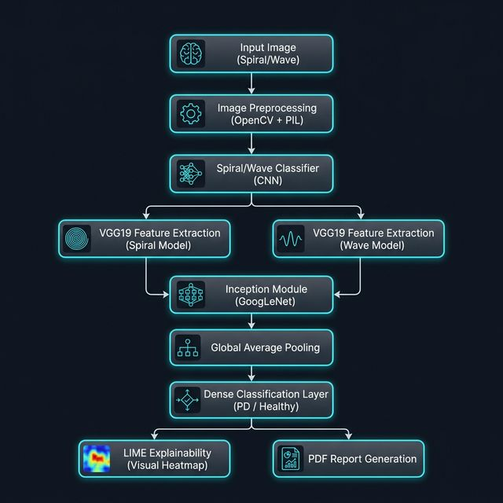
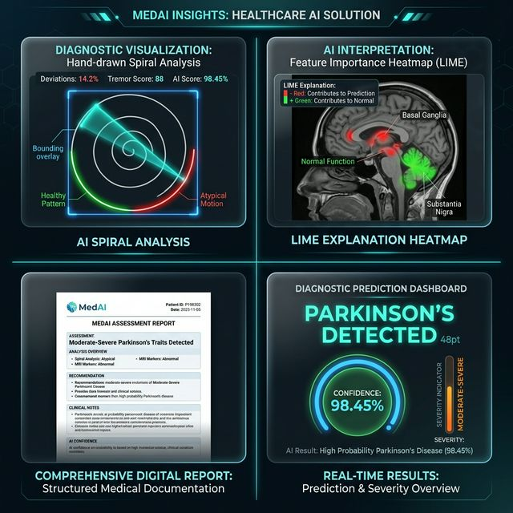
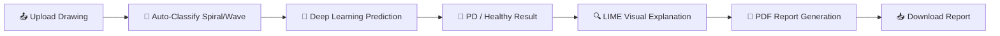
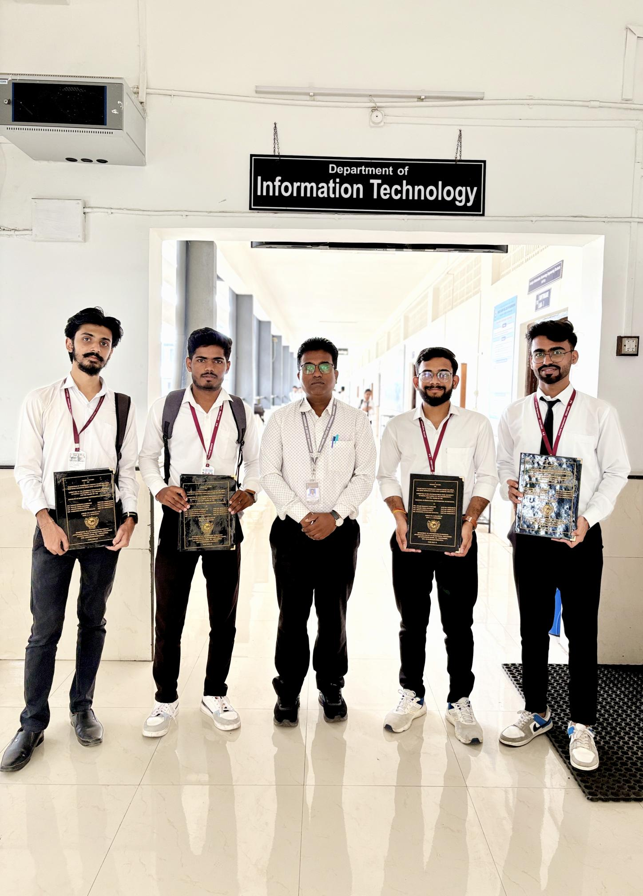
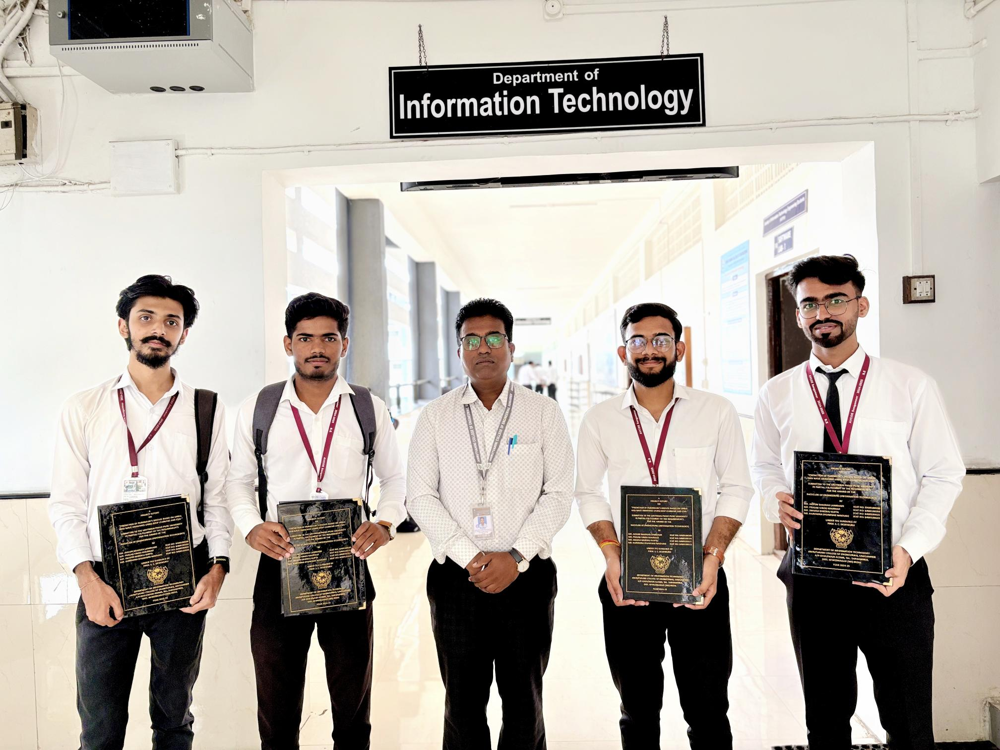
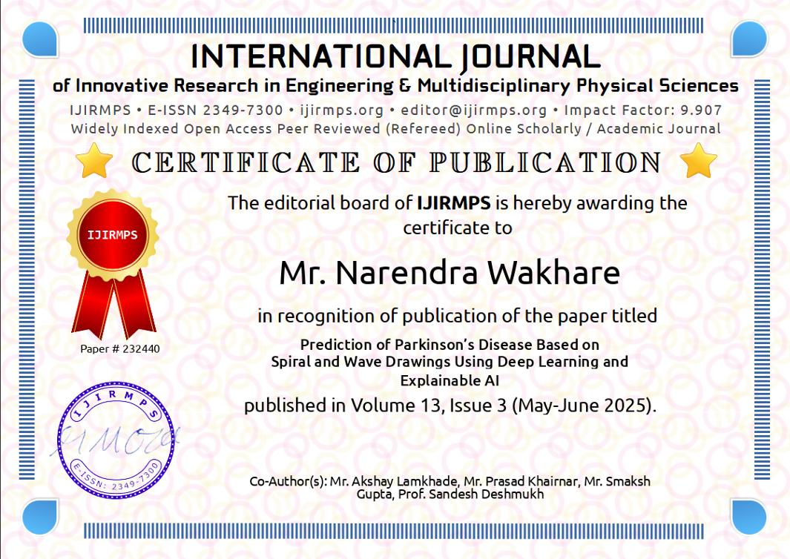

<div align="center">



<br/><br/>

# 🧠 NeuroSketch.AI

### _Prediction of Parkinson's Disease Based on Spiral and Wave Drawings Using Deep Learning and Explainable AI_

<br/>

<p>
  
  
  
  
</p>

<p>
  
  
  
  
  
  
</p>

<br/>

[🎯 Problem](#-problem-statement) • [💡 Solution](#-solution-neurosketchai) • [🧠 Architecture](#-model-architecture) • [📊 Results](#-results--performance) • [📸 Gallery](#-project-gallery) • [📄 Research](#-research-publication) • [🛠️ Tech Stack](#️-tech-stack)

<br/>

> _"Making AI Understandable for Healthcare — One Drawing at a Time"_

</div>

---

## 🏆 Project Highlights

<table>
<tr>
<td align="center">🎓</td>
<td><strong>Final Year B.E. IT Project — Amrutvahini College of Engineering</strong></td>
<td align="center">📄</td>
<td><strong>Research Published — IJIRMPS Vol. 13, Issue 3, 2025</strong></td>
</tr>
<tr>
<td align="center">🚀</td>
<td><strong>Presented at Amrut Expo 2025 (April 4-5, 2025)</strong></td>
<td align="center">🏅</td>
<td><strong>Certificate of Excellence — Amrut Expo 2025</strong></td>
</tr>
<tr>
<td align="center">📊</td>
<td><strong>98.45% Prediction Accuracy</strong></td>
<td align="center">🔍</td>
<td><strong>Clinically Interpretable with LIME Explainability</strong></td>
</tr>
</table>

---

## 🎯 Problem Statement

<div align="center">

<br/>
<em>Parkinson's Disease — Identifying Symptoms (1 in 100 adults over 65 are affected)</em>
</div>

<br/>

**Parkinson's Disease (PD)** is a progressive **neurodegenerative disorder** affecting **10M+ people worldwide**. Early diagnosis remains a critical challenge:

| Challenge | Description |
|:---------:|:------------|
| ❌ **Subtle Symptoms** | Early motor symptoms are difficult to detect clinically |
| ❌ **Manual Dependency** | Diagnosis relies heavily on subjective clinical observation |
| ❌ **Black-Box AI** | Existing AI models lack interpretability for clinicians |
| ❌ **Delayed Diagnosis** | Patients often diagnosed only after significant neurological damage |

<div align="center">

<br/>
<em>The complexity of Parkinson's Disease — affecting the nervous system, brain, movement, and cognition</em>
</div>

<br/>

> **💡 Insight:** Spiral and wave drawings have been clinically proven to reveal motor impairments associated with PD — _even in the earliest stages_.

---

## 💡 Solution: NeuroSketch.AI

<div align="center">

An **AI-powered diagnostic system** that transforms simple hand drawings into powerful diagnostic insights.

</div>

<br/>

<div align="center">
<table>
<tr>
<td align="center" width="250">

### ✍️ Input Analysis
Analyzes **Spiral** & **Wave** hand drawings uploaded by users

</td>
<td align="center" width="250">

### 🧠 Deep Learning
Hybrid **VGG19 + GoogLeNet** architecture for high-accuracy classification

</td>
<td align="center" width="250">

### 🔍 Explainable AI
**LIME** generates visual explanations highlighting critical diagnostic regions

</td>
<td align="center" width="250">

### 📄 Clinical Reports
Auto-generated **PDF reports** with predictions, severity, and visual explanations

</td>
</tr>
</table>
</div>

---

## 🧠 Model Architecture

<div align="center">



</div>

<br/>

```
📥 Input Image (Spiral / Wave Drawing)
        │
        ▼
🔧 Image Preprocessing (PIL + Resize to 224×224 + Normalize)
        │
        ▼
🔀 Spiral / Wave Classifier (CNN)
        │
   ┌────┴────┐
   ▼         ▼
🌀 Spiral  🌊 Wave
 Model      Model
   │         │
   ▼         ▼
🏗️ VGG19 Feature Extraction + Inception Module
        │
        ▼
📊 Global Average Pooling → Dense Layer → Sigmoid
        │
        ▼
🎯 Classification: Parkinson's / Healthy
        │
   ┌────┴────┐
   ▼         ▼
🔍 LIME     📄 PDF Report
Explanation  Generation
```

---

## ✨ Key Features

<div align="center">



</div>

<br/>

| Feature | Description |
|:-------:|:------------|
| 🧬 **Hybrid Deep Learning** | VGG19 (feature extraction) + GoogLeNet Inception (multi-scale analysis) |
| 🔍 **Explainable AI (LIME)** | Visual heatmaps showing _why_ the model made its decision |
| ⚡ **Real-Time Prediction** | Instant classification via interactive Streamlit web app |
| 📄 **Auto PDF Reports** | Professional medical-style reports with predictions & visual explanations |
| 🎯 **Severity Assessment** | Multi-level severity scoring: Normal → Initial → Moderate → Severe |
| 🔀 **Smart Image Routing** | Auto-detects whether input is Spiral or Wave and routes to the right model |

---

## 📊 Results & Performance

<div align="center">

| Metric | Score | Visual |
|:------:|:-----:|:------:|
| **Accuracy** | **98.45%** | 🟩🟩🟩🟩🟩🟩🟩🟩🟩🟩 |
| **Precision** | **97.92%** | 🟩🟩🟩🟩🟩🟩🟩🟩🟩🟨 |
| **Recall** | **98.70%** | 🟩🟩🟩🟩🟩🟩🟩🟩🟩🟩 |
| **F1 Score** | **98.31%** | 🟩🟩🟩🟩🟩🟩🟩🟩🟩🟩 |

</div>

> 📌 Model **outperforms** traditional ML approaches (SVM, Random Forest, KNN) by **15-20%**  
> 📌 Provides **clinically interpretable** predictions — not just a black-box answer

---

## 🖥️ System Workflow



| Step | Action | Detail |
|:----:|:------:|:-------|
| 1️⃣ | **Upload** | User uploads a spiral or wave hand drawing |
| 2️⃣ | **Classify** | AI auto-detects whether it's a spiral or wave |
| 3️⃣ | **Predict** | Hybrid VGG19+Inception model classifies PD vs Healthy |
| 4️⃣ | **Explain** | LIME highlights regions that influenced the prediction |
| 5️⃣ | **Report** | A professional PDF report is auto-generated |
| 6️⃣ | **Download** | User downloads the report with all clinical details |

---

## 📸 Project Gallery

### 🎪 Amrut Expo 2025 — Project Exhibition Poster

<div align="center">


<br/>
<em>📌 Full project poster presented at Amrut Expo 2025 — featuring Abstract, Objectives, Methodology, Model Architecture, Results & Conclusion</em>

</div>

---

### 👥 Our Team

<div align="center">



<br/>
<em>🎓 Team NeuroSketch.AI with Project Guide Prof. S. C. Deshmukh — Department of Information Technology</em>

<br/><br/>



<br/>
<em>📸 Team members holding their project reports at the Department of Information Technology</em>

</div>

---

### 🏅 Certificates & Achievements

<div align="center">

#### 📜 IJIRMPS Research Publication Certificate



<br/>
<em>✅ Certificate of Publication — IJIRMPS (Impact Factor: 9.907) | Paper #232440 | Volume 13, Issue 3 (May-June 2025)</em>
<br/>
<em>📝 Paper: "Prediction of Parkinson's Disease Based on Spiral and Wave Drawings Using Deep Learning and Explainable AI"</em>

<br/><br/>

#### 🏆 Amrut Expo 2025 — Certificate of Excellence


<br/>
<em>🏅 Certificate of Excellence — Amrut Expo 2025, Project Exhibition & Competition (April 4-5, 2025)</em>
<br/>
<em>🏛️ Amrutvahini College of Engineering, Sangamner — Accredited by NAAC A+, NBA, ISO 9001:2015, TCS</em>

</div>

---

### 📚 Research Paper & Project Documents

<div align="center">

| Document | Description | Link |
|:--------:|:------------|:----:|
| 📄 **Research Paper** | Full published paper in IJIRMPS 2025 | [View PDF](assets/Reasearch%20Paper.pdf) |
| 📋 **Abstract** | Research abstract summary | [View PDF](assets/Abstract.pdf) |
| 📘 **Final Project Report** | Complete B.E. IT Final Year Project Report | [View PDF](assets/Parkinson_Disease_Prediction_Final_Report.pdf) |
| 🏅 **Publication Certificates** | All author publication certificates | [View PDF](assets/Publication%20Cartificates.pdf) |
| 🏆 **Expo Certificates** | Amrut Expo 2025 participation certificates | [View PDF](assets/Amrut%20Expo%20certificates.pdf) |
| 📊 **Project Presentation** | PowerPoint presentation slides | [View PPT](assets/ppt.ppt) |

</div>

---

## 🛠️ Tech Stack

<div align="center">

| Layer | Technology | Purpose |
|:-----:|:----------:|:--------|
| 🐍 **Language** | Python 3.10+ | Core development language |
| 🧠 **Deep Learning** | TensorFlow / Keras | Model training & inference |
| 🏗️ **Architecture** | VGG19 + GoogLeNet Inception | Feature extraction + multi-scale analysis |
| 🎓 **Transfer Learning** | ImageNet Weights | Pre-trained feature representations |
| 🔍 **Explainability** | LIME | Interpretable AI visual explanations |
| 👁️ **Image Processing** | OpenCV + PIL | Image preprocessing & augmentation |
| 🌐 **Web App** | Streamlit | Interactive real-time web interface |
| 📄 **Reports** | FPDF | Automated PDF report generation |
| 🗄️ **Database** | SQLite | Lightweight data storage |
| 📊 **Visualization** | Matplotlib + scikit-image | Charts & image boundary marking |

</div>

---

## 📂 Project Structure

```
NeuroSketch-AI/
│
├── 📄 app.py                                          # Streamlit Web Application (Main Entry)
├── 🧠 model_loader.py                                 # Model Loading Utilities
├── ⚙️ processing.py                                   # Preprocessing, LIME, PDF Generation
│
├── 🤖 models/
│   ├── spiral_wave_classifier.keras                    # Spiral vs Wave Classifier (CNN)
│   ├── vgg19_inception_model_Spiral.keras              # VGG19+Inception Spiral Model
│   └── vgg19_inception_model_Wave1.keras               # VGG19+Inception Wave Model
│
├── 🖼️ assets/
│   ├── banner.png                                      # README Banner
│   ├── architecture.png                                # Architecture Diagram
│   ├── features.png                                    # Features Showcase
│   ├── PD1.jpg                                         # Parkinson's Symptoms Infographic
│   ├── PD2.jpg                                         # Parkinson's Word Cloud
│   ├── team.jpg                                        # Team Photo with Guide
│   ├── group.jpg                                       # Group Photo
│   ├── Cartificate.png                                 # IJIRMPS Publication Certificate
│   ├── Cartificate Expo.png                            # Amrut Expo Certificate
│   ├── Final_AmrutExpo_Project Exhibition_...jpeg       # Expo Poster
│   ├── Abstract.pdf                                    # Research Abstract
│   ├── Reasearch Paper.pdf                             # Published Research Paper
│   ├── Parkinson_Disease_Prediction_Final_Report.pdf   # Full Project Report
│   ├── Publication Cartificates.pdf                    # All Author Certificates
│   ├── Amrut Expo certificates.pdf                     # Expo Certificates
│   └── ppt.ppt                                        # Project Presentation
│
├── 📋 requirements.txt                                 # Python Dependencies
└── 📖 README.md                                        # This File
```

---

## ⚙️ Installation & Setup

### Prerequisites

- Python 3.10 or higher
- pip (Python package manager)

### Quick Start

```bash
# 1️⃣ Clone the Repository
git clone https://github.com/yourusername/NeuroSketch-AI.git
cd NeuroSketch-AI

# 2️⃣ Create Virtual Environment (Recommended)
python -m venv venv
source venv/bin/activate        # On macOS/Linux
venv\Scripts\activate           # On Windows

# 3️⃣ Install Dependencies
pip install -r requirements.txt

# 4️⃣ Download AI Models
# Download the pre-trained models from the Google Drive link below:
# 🔗 [Download Models Here](https://drive.google.com/file/d/18_h7xQdfhXjzmmEYtoU39TK_Sh69feb_/view?usp=sharing)
# After downloading, extract/place the .keras files into the `models/` directory.

# 5️⃣ Run the Application
streamlit run app.py
```

> 🌐 The app will open at `http://localhost:8501`

---

## 📄 Research Publication

<div align="center">

### 📌 Published in IJIRMPS — International Journal of Innovative Research in Multidisciplinary Perspectives and Sciences

| Detail | Value |
|:------:|:------|
| 📝 **Paper Title** | Prediction of Parkinson's Disease Based on Spiral and Wave Drawings Using Deep Learning and Explainable AI |
| 📚 **Journal** | IJIRMPS (E-ISSN: 2349-7300) |
| 📊 **Impact Factor** | 9.907 |
| 📖 **Volume / Issue** | Volume 13, Issue 3 (May-June 2025) |
| 🔢 **Paper No.** | #232440 |
| 👨‍🔬 **Authors** | Narendra Wakhare, Akshay Lamkhade, Prasad Khairnar, Smaksh Gupta |
| 👨‍🏫 **Guide** | Prof. S. C. Deshmukh |

<br/>

📄 [Read the Full Paper](assets/Reasearch%20Paper.pdf) &nbsp;&nbsp;|&nbsp;&nbsp; 📋 [View Abstract](assets/Abstract.pdf) &nbsp;&nbsp;|&nbsp;&nbsp; 🏅 [Publication Certificates](assets/Publication%20Cartificates.pdf)

</div>

---

## 👥 Team Members

<div align="center">

|  |  |  |  |
|:---:|:---:|:---:|:---:|
| **Narendra Wakhare** | **Akshay Lamkhade** | **Prasad Khairnar** | **Smaksh Gupta** |

<br/>

👨‍🏫 **Project Guide:** Prof. S. C. Deshmukh  
🏛️ **Department of Information Technology Engineering**  
🎓 **Amrutvahini College of Engineering, Sangamner**

</div>

---

## 🚀 Future Enhancements

<div align="center">

| Enhancement | Description | Status |
|:-----------:|:------------|:------:|
| 📱 **Mobile App** | Flutter/React Native cross-platform app | 🔜 Planned |
| 🎤 **Voice Analysis** | Voice tremor detection for multi-modal diagnosis | 🔬 Research |
| 🚶 **Gait Analysis** | Walking pattern analysis using wearable sensors | 🔬 Research |
| ☁️ **Cloud Deployment** | Deploy on AWS/GCP for global access | 🔜 Planned |
| 🏥 **Hospital Integration** | FHIR/HL7 standards for EHR integration | 📋 Proposed |
| 🧠 **Multi-Disease** | Extend to detect Alzheimer's, Essential Tremor | 📋 Proposed |

</div>

---

## ❤️ Impact & Social Relevance

<div align="center">
<table>
<tr>
<td align="center" width="200">

### ✅ Early Detection
Enables **non-invasive** early screening of Parkinson's Disease

</td>
<td align="center" width="200">

### 🧠 Interpretable AI
Clinicians can **see and understand** why the AI made its prediction

</td>
<td align="center" width="200">

### 🌍 Scalable Solution
Can be deployed to **rural and underserved** areas via the web

</td>
<td align="center" width="200">

### 💊 Better Outcomes
Early detection leads to **better treatment** and improved quality of life

</td>
</tr>
</table>
</div>

---

## 📬 Contact

<div align="center">

| Platform | Link |
|:--------:|:----:|
| 📧 **Email** | [narendrawakhare@gmail.com](mailto:narendrawakhare@gmail.com) |
| 🔗 **LinkedIn** | [https://www.linkedin.com/in/narendrawakhare/] |
| 🐱 **GitHub** | [https://github.com/narendra-44] |

</div>

---

<div align="center">

### ⭐ If you found this project useful, give it a star!

<br/>


<br/><br/>

> 🧠 _"Making AI Understandable for Healthcare"_

<br/>

**© 2025 NeuroSketch.AI | Amrutvahini College of Engineering — All Rights Reserved**

</div>
